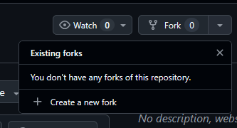
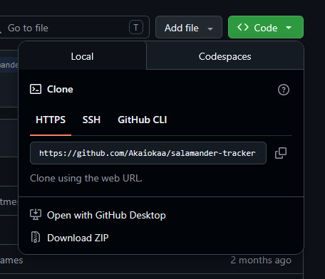
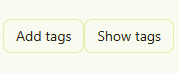
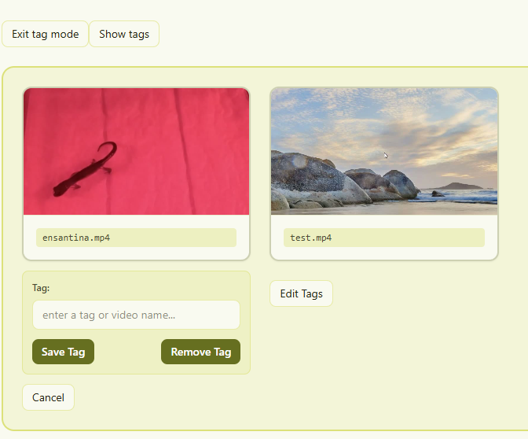
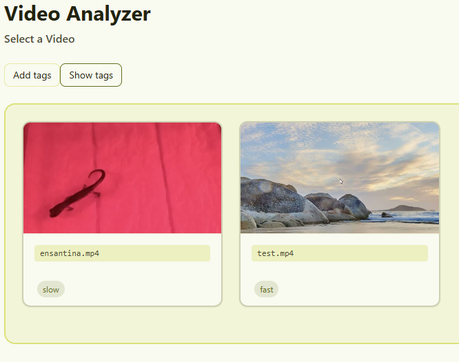

# Team Members
- Brendan Villaraza
- Allen Resulidze

# What is Slamander Tracker
Welcome to the salamander tracker repo front end. This project is used to track the largest connected centroid of pixels based on a selected threshold and target color. The main focus of this project is tracking the centroid of a salamanders movement over a long course of time. This project pulls data from the back end please make sure to set it up so this project properly functions.

Please refer to this link for intructions on how to set up the backend:  https://github.com/allenres/centroid-finder

# Set Up Guide
First fork and clone the project from the repo 

Press the fork button and create a new fork:

Then press code and copy the github link

Open your command line of choice and clone the repo inside a folder and run the command:

        git clone https://github.com/youruserhere/salamander-tracker.git

Then cd into the folder

        cd salamander-tracker/

Lastly run code . this will open the repo in vscode

        code .

In the terminal run the command npm i this will install the required modules and dependencies

        npm i

To run the front end type

        npm run dev

## Note: you must run the back end of this project 
Please refer to this link for intructions on how to set up the backend:  https://github.com/allenres/centroid-finder

Once set up on the backend cd into server then run node index.js

        cd server/

        node index.js

If properly working you should see

        Salamander API server running on http://localhost:3000

Congratulations you are set up!

# Color Palette

    --color-text: #222310;
    --color-bg: #f9faf0;
    --color-primary: #666f20;
    --color-secondary: #dce17a;
    --color-accent: #f7ff5c;

# How to use feature
Our project has a tag feature for videos section. It uses localStorage to save tags you've made so even if you refesh it will stay, and you can have multiple tags for each one. There are two main buttons add tags and show tags. Show tags will show show all tags on each video the add tags button will put you in tag mode. Tag mode puts you in a mode where you can save and remove tags by first typing and pressing.

Relevant screenshots:

# Tag Buttons

# Tag Mode (save/remove)

# Tags

# Local Storage

